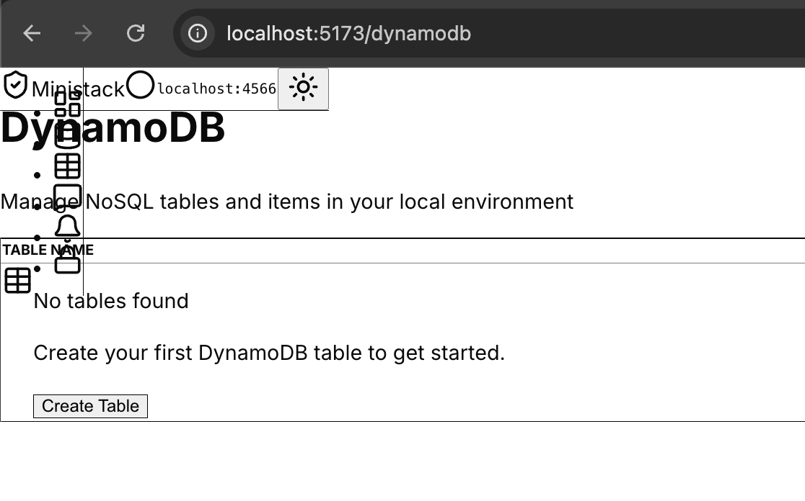

# ⚡ MiniStack UI

Ministack UI is a powerful, modern, open-source dashboard designed for managing your simulated AWS services. It provides an intuitive and feature-rich interface for interacting with [MiniStack](https://github.com/Nahuel990/ministack), the lightweight and efficient alternative to LocalStack.



## 💡 Usage

MiniStack UI connects to your local MiniStack instance to provide a unified management experience across all your simulated infrastructure.

### 🌐 Connection & Health

By default, the UI connects to `http://localhost:4566`. You can see the real-time status and version of your MiniStack instance directly in the top navigation bar.

- **Green Indicator**: MiniStack is running and reachable.
- **Red Indicator**: Connection error or MiniStack is offline.

### 📊 Dashboard

The main Dashboard provides an overview of all 22+ supported services. Each card shows the current count of resources (Buckets, Tables, Functions, etc.), and clicking on any card navigates you directly to that service's management page.

### 🛠️ Service Management

Each service has its own dedicated view designed with specific management capabilities:

- **S3**: Browse buckets, manage folders, upload/download objects, and configure advanced settings like Versioning, Object Lock, and Notifications.
- **Lambda**: List functions, view details, and invoke them with custom payloads to see logs and responses in real-time.
- **DynamoDB**: Explore tables, manage items with a built-in JSON editor, and configure table settings.
- **Secrets Manager**: Create, view, and manage your local secrets with a clean interface.
- **SQS & SNS**: Monitor message queues, send/receive messages with batch support, and manage topic subscriptions with searchable resource lists.
- **CloudWatch Logs**: Browse log groups, streams, and view events with real-time filtering.
- **And more**: Support for IAM, SSM, SES, Route 53, EventBridge, KMS, EC2, RDS, ECS, Cognito, ACM, WAFv2, Kinesis, and Step Functions.

### 🧹 Resetting State

From the Dashboard, you can find a **"Reset MiniStack"** button. This uses the internal MiniStack API to wipe all service state back to empty—perfect for getting a clean environment between test runs or feature development without restarting your containers.

---

## 🛠️ Development

Follow these steps to set up the MiniStack UI project locally for development or customization.

### 📋 Prerequisites

- **Node.js**: v24 or higher recommended.
- **MiniStack**: Ensure you have [MiniStack](https://github.com/Nahuel990/ministack) running locally (default: `http://localhost:4566`).

### 🚀 Getting Started

1. **Clone the repository**:

   ```bash
   git clone https://github.com/your-username/ministack-front.git
   cd ministack-front
   ```

2. **Install dependencies**:

   ```bash
   npm install
   ```

3. **Start the development server**:

   ```bash
   npm run dev
   ```

4. **Access the UI**:
   Open [http://localhost:5173](http://localhost:5173) in your browser.

### 🐳 Docker Deployment

You can run MiniStack UI using the pre-built Docker image from GHCR. This is the recommended way to run it alongside MiniStack.

#### Using Docker Compose

```bash
docker-compose up -d
```

#### Using Docker Run

```bash
docker run -d -p 5173:80 --name ministack-ui ghcr.io/hackjack-101/ministack-front:latest
```

The UI will be available at `http://localhost:5173`.

### 📜 Available Scripts

- `npm run dev`: Starts the Vite development server.
- `npm run build`: Compiles the project and builds for production.
- `npm run preview`: Previews the production build locally.
- `npm run lint`: Runs ESLint for code quality checks.
- `npm run format`: Formats code using Prettier.
- `npm run test`: Starts the Vitest test runner.
- `npm run test:run`: Runs Vitest tests once and exits.

### 🧪 Automated Quality Checks

This project uses [Husky](https://typicode.github.io/husky/) and [lint-staged](https://github.com/lint-staged/lint-staged) to ensure high code quality. On every commit, the following checks are performed automatically:

1. **Linting**: Runs `eslint --fix` on staged files.
2. **Formatting**: Runs `prettier --write` on staged files.
3. **Tests**: Runs `npm run test:run` to ensure no regressions.

Any failures in these steps will prevent the commit, ensuring that only clean, tested code reaches the repository.

---

## 🏗️ Tech Stack

- **Framework**: [React 19](https://react.dev/) + [Vite](https://vitejs.dev/)
- **Styling**: [Tailwind CSS 4](https://tailwindcss.com/)
- **Language**: [TypeScript](https://www.typescriptlang.org/)
- **Icons**: [Lucide React](https://lucide.dev/)
- **AWS SDK**: [@aws-sdk/client-\*](https://aws.amazon.com/sdk-for-javascript/)
- **Routing**: [React Router 7](https://reactrouter.com/)

---

## 🤝 Contributing

Contributions are welcome! Please feel free to submit a Pull Request.

## 📄 License

This project is licensed under the MIT License - see the [LICENSE](LICENSE) file for details.
